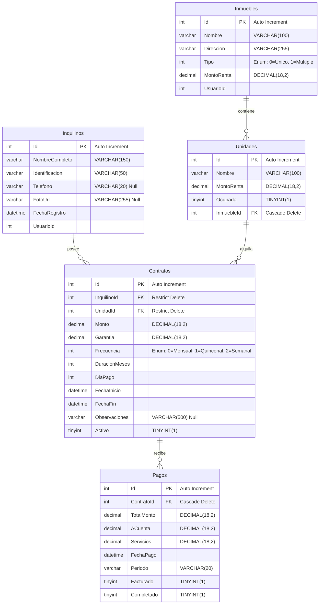

# 🏢 Organización, Estructura y Base de Datos del Proyecto RentaFácil

Este documento detalla la arquitectura general, la estructura de archivos, el flujo de datos y el esquema de base de datos relacional (MySQL) para el proyecto **RentaFácil**.

---

## 📌 Arquitectura General

El proyecto se divide en tres proyectos principales:

1. **`RentaFacil.Shared`**: Biblioteca de clases con los modelos de datos y DTOs (Data Transfer Objects) que comparten el cliente y el servidor.
2. **`RentaFacil.API` (Servidor)**: Backend basado en **ASP.NET Core Web API** y **Entity Framework Core** que gestiona la persistencia en base de datos SQLite (en local) y MySQL (en producción). Genera los recibos PDF mediante **QuestPDF**.
3. **`RentaFacil.MAUI` (Cliente)**: Frontend basado en **.NET MAUI Blazor Hybrid**. Combina la potencia multiplataforma de .NET MAUI (Android, iOS, Windows, Mac) con vistas Web responsivas escritas en HTML, CSS y C# (Blazor).

---

## 📂 Estructura de Directorios y Archivos

```
RentaFacilApp/
│
├── RentaFacil.Shared/                  ← Modelos compartidos (DTOs y Enums)
│   ├── Models/
│   │   ├── ContratoDto.cs
│   │   ├── InmuebleDto.cs
│   │   ├── InquilinoDto.cs
│   │   └── PagoDto.cs
│   └── Enums/
│       ├── FrecuenciaPago.cs
│       └── TipoInmueble.cs
│
├── RentaFacil.API/                     ← Backend Web API
│   ├── Data/
│   │   ├── AppDbContext.cs             ← Contexto de base de datos (EF Core)
│   │   └── Migrations/                 ← Historial de migraciones SQLite
│   │
│   ├── Models/                         ← Entidades de Base de Datos
│   │   ├── Contrato.cs
│   │   ├── Inmueble.cs
│   │   ├── Inquilino.cs
│   │   ├── Pago.cs
│   │   └── Unidad.cs
│   │
│   ├── Repositories/                   ← Acceso a Datos (Patrón Repository)
│   │   ├── Interfaces/
│   │   │   ├── IInquilinoRepository.cs
│   │   │   ├── IInmuebleRepository.cs
│   │   │   ├── IContratoRepository.cs
│   │   │   └── IPagoRepository.cs
│   │   ├── InquilinoRepository.cs
│   │   ├── InmuebleRepository.cs
│   │   ├── ContratoRepository.cs
│   │   └── PagoRepository.cs
│   │
│   ├── Services/                       ← Lógica de Negocio
│   │   ├── Interfaces/
│   │   │   ├── IInquilinoService.cs
│   │   │   ├── IInmuebleService.cs
│   │   │   ├── IContratoService.cs
│   │   │   ├── IPagoService.cs
│   │   │   └── IReciboService.cs
│   │   ├── InquilinoService.cs
│   │   ├── InmuebleService.cs
│   │   ├── ContratoService.cs
│   │   ├── PagoService.cs
│   │   └── ReciboService.cs            ← QuestPDF (formato Ticket y Carta)
│   │
│   ├── Controllers/                    ← Endpoints REST
│   │   ├── InquilinosController.cs
│   │   ├── InmueblesController.cs
│   │   ├── OtherControllers.cs         ← Contratos, Pagos y Unidades
│   │   └── AuthController.cs
│   │
│   ├── Program.cs                      ← Configuración e inyección de dependencias
│   └── rentafacil.db                   ← Base de datos SQLite local
│
└── RentaFacil.MAUI/                    ← Frontend Blazor Hybrid
    ├── Services/                       ← Clientes de comunicación API
    │   ├── ApiClient.cs                ← Llamadas REST utilizando HttpClient
    │   └── AuthService.cs              ← Gestión de sesión
    │
    ├── ViewModels/                     ← Modelos de vista del Frontend
    │   └── EstadoInquilinoViewModel.cs
    │
    ├── wwwroot/                        ← Recursos estáticos del navegador
    │   ├── index.html                  ← Hoja de carga y CDN de Bootstrap Icons
    │   └── css/
    │       └── app.css
    │
    ├── Components/                     ← UI y Vistas
    │   ├── Layout/
    │   │   ├── MainLayout.razor        ← Contenedor principal con sidebar
    │   │   ├── LoginLayout.razor
    │   │   └── NavMenu.razor           ← Menú lateral con enlaces
    │   │
    │   └── Pages/                      ← Pantallas de la aplicación
    │       ├── Home.razor              ← Dashboard principal
    │       ├── Inquilinos.razor        ← Listado de inquilinos con bottom sheet
    │       ├── CrearInquilino.razor    ← Registro/Edición de inquilinos
    │       ├── Inmuebles.razor         ← Listado de inmuebles con bottom sheet
    │       ├── CrearInmueble.razor     ← Registro/Edición de inmuebles
    │       ├── Unidades.razor          ← Gestión de unidades de inmuebles múltiples
    │       ├── Contratos.razor         ← Listado de contratos
    │       ├── CrearContrato.razor     ← Registro de contratos
    │       ├── Pagos.razor
    │       ├── CrearPago.razor         ← Registro de pagos
    │       ├── DetallePagos.razor      ← Historial de pagos
    │       ├── Ingresos.razor          ← Reporte mensual de ingresos
    │       ├── Login.razor
    │       ├── NotFound.razor
    │       └── Placeholder.razor
```

---

## 🗄️ Estructura de la Base de Datos (MySQL)

A continuación se muestra el diseño relacional de la base de datos de producción mapeado desde Entity Framework Core a **MySQL**.

### 📊 Diagrama Entidad-Relación (ERD)



---

### 📝 Estructura de Tablas Detallada

#### 1. Tabla: `Inquilinos`
Registra la información de los arrendatarios en la plataforma.

| Campo | Tipo | Nulo | Llave | Extra / Descripción |
|---|---|---|---|---|
| `Id` | `INT` | NO | PRI | `AUTO_INCREMENT` |
| `NombreCompleto` | `VARCHAR(150)` | NO | | Nombre completo del inquilino |
| `Identificacion` | `VARCHAR(50)` | NO | | DNI, Cédula de Identidad o RUC |
| `Telefono` | `VARCHAR(20)` | SÍ | | Número telefónico de contacto |
| `FotoUrl` | `VARCHAR(255)` | SÍ | | Ruta de almacenamiento de foto |
| `FechaRegistro` | `DATETIME` | NO | | Fecha en que se creó el registro |
| `UsuarioId` | `INT` | NO | | Dueño de la propiedad / arrendador |

#### 2. Tabla: `Inmuebles`
Registra las propiedades inmobiliarias (Casas, Edificios, Locales).

| Campo | Tipo | Nulo | Llave | Extra / Descripción |
|---|---|---|---|---|
| `Id` | `INT` | NO | PRI | `AUTO_INCREMENT` |
| `Nombre` | `VARCHAR(100)` | NO | | Nombre descriptivo del inmueble |
| `Direccion` | `VARCHAR(255)` | NO | | Dirección física completa |
| `Tipo` | `INT` | NO | | Tipo: `0` (Único) / `1` (Múltiple) |
| `MontoRenta` | `DECIMAL(18,2)`| NO | | Costo base (solo aplica para Únicos) |
| `UsuarioId` | `INT` | NO | | Arrendador propietario |

#### 3. Tabla: `Unidades`
Registra las habitaciones, apartamentos u oficinas de un inmueble múltiple.

| Campo | Tipo | Nulo | Llave | Extra / Descripción |
|---|---|---|---|---|
| `Id` | `INT` | NO | PRI | `AUTO_INCREMENT` |
| `Nombre` | `VARCHAR(100)` | NO | | Ej: "Depto 101", "Oficina B" |
| `MontoRenta` | `DECIMAL(18,2)`| NO | | Precio de alquiler de esta unidad |
| `Ocupada` | `TINYINT(1)` | NO | | Estado de ocupación (0=Libre, 1=Alquilada) |
| `InmuebleId` | `INT` | NO | MUL | FK -> `Inmuebles(Id)` (Borrado en Cascada) |

#### 4. Tabla: `Contratos`
Almacena las condiciones del arrendamiento ligando a un inquilino con una unidad.

| Campo | Tipo | Nulo | Llave | Extra / Descripción |
|---|---|---|---|---|
| `Id` | `INT` | NO | PRI | `AUTO_INCREMENT` |
| `InquilinoId` | `INT` | NO | MUL | FK -> `Inquilinos(Id)` (Borrado Restringido) |
| `UnidadId` | `INT` | NO | MUL | FK -> `Unidades(Id)` (Borrado Restringido) |
| `Monto` | `DECIMAL(18,2)`| NO | | Precio pactado de alquiler |
| `Garantia` | `DECIMAL(18,2)`| NO | | Monto depositado en garantía |
| `Frecuencia` | `INT` | NO | | Frecuencia: `0` (Mensual), `1` (Quincenal), `2` (Semanal) |
| `DuracionMeses`| `INT` | NO | | Plazo de duración en meses |
| `DiaPago` | `INT` | NO | | Día límite programado para abonar |
| `FechaInicio` | `DATETIME` | NO | | Fecha en que empieza el contrato |
| `FechaFin` | `DATETIME` | NO | | Fecha calculada de fin de contrato |
| `Observaciones`| `VARCHAR(500)` | SÍ | | Anotaciones internas del arrendamiento |
| `Activo` | `TINYINT(1)` | NO | | Estado del contrato (0=Finalizado, 1=Vigente) |

#### 5. Tabla: `Pagos`
Almacena el registro mensual del pago de renta y servicios extras de cada contrato.

| Campo | Tipo | Nulo | Llave | Extra / Descripción |
|---|---|---|---|---|
| `Id` | `INT` | NO | PRI | `AUTO_INCREMENT` |
| `ContratoId` | `INT` | NO | MUL | FK -> `Contratos(Id)` (Borrado en Cascada) |
| `TotalMonto` | `DECIMAL(18,2)`| NO | | Costo total del alquiler |
| `ACuenta` | `DECIMAL(18,2)`| NO | | Monto abonado hasta el momento |
| `Servicios` | `DECIMAL(18,2)`| NO | | Monto extra abonado por servicios (luz/agua) |
| `FechaPago` | `DATETIME` | NO | | Fecha en que se cobró |
| `Periodo` | `VARCHAR(20)` | NO | | Periodo facturado (Ej: "MAY-JUN/26") |
| `Facturado` | `TINYINT(1)` | NO | | Factura o recibo entregado (0=No, 1=Sí) |
| `Completado` | `TINYINT(1)` | NO | | Pago cubierto al 100% (0=Incompleto, 1=Completo)|

---

### 💻 Script SQL de Creación (DDL para MySQL)

```sql
CREATE DATABASE IF NOT EXISTS `rentafacil_db` CHARACTER SET utf8mb4 COLLATE utf8mb4_unicode_ci;
USE `rentafacil_db`;

-- 1. Tabla Inquilinos
CREATE TABLE `Inquilinos` (
  `Id` INT AUTO_INCREMENT PRIMARY KEY,
  `NombreCompleto` VARCHAR(150) NOT NULL,
  `Identificacion` VARCHAR(50) NOT NULL,
  `Telefono` VARCHAR(20) DEFAULT NULL,
  `FotoUrl` VARCHAR(255) DEFAULT NULL,
  `FechaRegistro` DATETIME NOT NULL,
  `UsuarioId` INT NOT NULL
) ENGINE=InnoDB DEFAULT CHARSET=utf8mb4 COLLATE=utf8mb4_unicode_ci;

-- 2. Tabla Inmuebles
CREATE TABLE `Inmuebles` (
  `Id` INT AUTO_INCREMENT PRIMARY KEY,
  `Nombre` VARCHAR(100) NOT NULL,
  `Direccion` VARCHAR(255) NOT NULL,
  `Tipo` INT NOT NULL,
  `MontoRenta` DECIMAL(18,2) NOT NULL,
  `UsuarioId` INT NOT NULL
) ENGINE=InnoDB DEFAULT CHARSET=utf8mb4 COLLATE=utf8mb4_unicode_ci;

-- 3. Tabla Unidades
CREATE TABLE `Unidades` (
  `Id` INT AUTO_INCREMENT PRIMARY KEY,
  `Nombre` VARCHAR(100) NOT NULL,
  `MontoRenta` DECIMAL(18,2) NOT NULL,
  `Ocupada` TINYINT(1) NOT NULL DEFAULT 0,
  `InmuebleId` INT NOT NULL,
  CONSTRAINT `FK_Unidades_Inmuebles_InmuebleId` FOREIGN KEY (`InmuebleId`) 
    REFERENCES `Inmuebles` (`Id`) ON DELETE CASCADE
) ENGINE=InnoDB DEFAULT CHARSET=utf8mb4 COLLATE=utf8mb4_unicode_ci;

-- 4. Tabla Contratos
CREATE TABLE `Contratos` (
  `Id` INT AUTO_INCREMENT PRIMARY KEY,
  `InquilinoId` INT NOT NULL,
  `UnidadId` INT NOT NULL,
  `Monto` DECIMAL(18,2) NOT NULL,
  `Garantia` DECIMAL(18,2) NOT NULL,
  `Frecuencia` INT NOT NULL,
  `DuracionMeses` INT NOT NULL,
  `DiaPago` INT NOT NULL,
  `FechaInicio` DATETIME NOT NULL,
  `FechaFin` DATETIME NOT NULL,
  `Observaciones` VARCHAR(500) DEFAULT NULL,
  `Activo` TINYINT(1) NOT NULL DEFAULT 1,
  CONSTRAINT `FK_Contratos_Inquilinos_InquilinoId` FOREIGN KEY (`InquilinoId`) 
    REFERENCES `Inquilinos` (`Id`) ON DELETE RESTRICT,
  CONSTRAINT `FK_Contratos_Unidades_UnidadId` FOREIGN KEY (`UnidadId`) 
    REFERENCES `Unidades` (`Id`) ON DELETE RESTRICT
) ENGINE=InnoDB DEFAULT CHARSET=utf8mb4 COLLATE=utf8mb4_unicode_ci;

-- 5. Tabla Pagos
CREATE TABLE `Pagos` (
  `Id` INT AUTO_INCREMENT PRIMARY KEY,
  `ContratoId` INT NOT NULL,
  `TotalMonto` DECIMAL(18,2) NOT NULL,
  `ACuenta` DECIMAL(18,2) NOT NULL,
  `Servicios` DECIMAL(18,2) NOT NULL,
  `FechaPago` DATETIME NOT NULL,
  `Periodo` VARCHAR(20) NOT NULL,
  `Facturado` TINYINT(1) NOT NULL DEFAULT 0,
  `Completado` TINYINT(1) NOT NULL DEFAULT 0,
  CONSTRAINT `FK_Pagos_Contratos_ContratoId` FOREIGN KEY (`ContratoId`) 
    REFERENCES `Contratos` (`Id`) ON DELETE CASCADE
) ENGINE=InnoDB DEFAULT CHARSET=utf8mb4 COLLATE=utf8mb4_unicode_ci;

-- Índices de optimización de búsquedas y uniones
CREATE INDEX `IX_Unidades_InmuebleId` ON `Unidades` (`InmuebleId`);
CREATE INDEX `IX_Contratos_InquilinoId` ON `Contratos` (`InquilinoId`);
CREATE INDEX `IX_Contratos_UnidadId` ON `Contratos` (`UnidadId`);
CREATE INDEX `IX_Pagos_ContratoId` ON `Pagos` (`ContratoId`);
